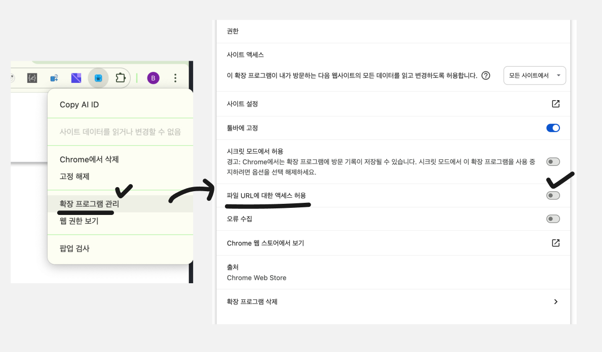

# Copy AI ID

**Install from the Chrome Web Store:**  
<https://chromewebstore.google.com/detail/opodkffbpbkjjechadlpogecbmlbmkgi?utm_source=item-share-cb>

[한국어](README.ko.md)

Copy AI ID is a `data-ai-id`-first Chrome extension editor for rendered pages. Turn it on from the current tab to open a full-screen Shadow DOM editor with a layout tree, responsive iframe preview, and note panel for copying AI-ready UI change notes. Selected elements are inserted into the notebook as compact `el-N` chips; elements with `data-ai-id` map to stable references, and elements without one can still be selected through generated fallback targets.

## Editor workflow

1. Open a rendered page. Pages with semantic `data-ai-id` attributes work best, but fallback selection also works on no-ID or mixed pages.
2. Press **Shift + Z + Space**, or open the extension popup and click **Turn ON**.
3. Copy AI ID opens a full-screen editor over the current tab:
   - **Left — Layout tree:** full DOM hierarchy for structure; every DOM row is keyboard-navigable/selectable. Rows with `data-ai-id` insert stable chip targets, and no-ID rows insert fallback chip targets when fallback metadata is available.
   - **Center — Preview:** iframe preview of the current URL with the `copy-ai-id-preview=1` query marker, six breakpoint buttons, zoom controls, and fit/reset controls.
   - **Right — Note panel:** one Lexical-backed notebook draft for selected stable `data-ai-id` targets or generated fallback targets. Targets appear as compact `el-N` chips.
4. Highlight DOM nodes from the preview, the layout tree, or the keyboard.
5. Press **Space** to insert/focus a notebook chip such as `el-1`. Copy AI ID uses `data-ai-id` first for the chip target; if the highlighted node has no usable `data-ai-id`, the chip stores fallback metadata without exposing long selector/path/context text in the editor. Click a chip to reveal/highlight its linked preview element. Chip numbers are stable and are not renumbered after deletion, so a draft can contain `el-1`, `el-3`, and `el-4`.
6. Press **Shift + Enter** or click **Copy** to copy the notebook as AI-friendly Markdown with `## Requests`, `## Targets`, and `## Rules` sections. Inline chips are rendered as readable `@el-N` mentions, and fallback targets include selector/path/context details.
7. Close the editor with the toolbar close button, **Esc**, or **Shift + Z + Space**.

If the same `data-ai-id` appears multiple times, Copy AI ID shows each instance separately with an instance badge and duplicate warning so the selected DOM node stays unambiguous.

Some sites block iframe embedding with `X-Frame-Options` or `frame-ancestors` CSP. Copy AI ID reports that state inside the editor, but it cannot bypass the site policy.

## Shortcuts

| Shortcut | Action |
| --- | --- |
| **Shift + Z + Space** | Toggle Copy AI ID editor on/off |
| **ArrowUp** | Move to the previous/left layout-tree sibling; if none, move to the parent |
| **ArrowRight** | Move to the next/right sibling; if none, climb to an ancestor's next/right sibling and enter its first child |
| **ArrowLeft** | Move to the previous/left sibling; if none, climb to an ancestor's previous/left sibling and enter its deepest last descendant |
| **ArrowDown** | Move to the first child; if none, move to the next/right sibling or the nearest ancestor's next/right sibling |
| **Space** | Insert/focus the highlighted node as a compact `el-N` chip. The chip maps to a stable `data-ai-id` target first; otherwise it stores a generated fallback target when available. |
| **Shift + Enter** | Copy the current notebook text with suffixes |
| **Esc** | Clear selection or close/off the editor where applicable |

Keyboard traversal moves through every layout-tree DOM node, not only nodes with `data-ai-id`. **Space** remains `data-ai-id`-first, while no-ID nodes use fallback chips as a less-stable bridge. See [`docs/keyboard-traversal.md`](docs/keyboard-traversal.md) for examples.

Shortcuts are ignored while typing in editable fields or during IME composition, except **Shift + Enter** inside the notebook copies the current notebook.

## What is `data-ai-id`?

`data-ai-id` is a stable semantic HTML attribute that gives AI tools, browser automation, QA reviewers, and maintainers a precise handle for UI elements.

```html
<button data-ai-id="login-form-submit-button">Sign in</button>
```

## Add `data-ai-id` with the skill

This repository includes an `add-data-ai-id` skill for adding stable semantic IDs to HTML, JSX, TSX, and component markup.

After downloading this repository, ask your AI coding assistant to install the skill. It can install the skill for you right away.

### Use the skill

Codex:

```text
$add-data-ai-id @src/components/LoginForm.tsx
```

Claude Code:

```text
/add-data-ai-id @src/components/LoginForm.tsx
```

The skill inspects existing project conventions first. If no convention exists, it uses deterministic parent-child kebab-case IDs such as:

```html
<form data-ai-id="login-form">
  <label data-ai-id="login-form-email-field-label">Email</label>
  <input data-ai-id="login-form-email-field-input" />
  <button data-ai-id="login-form-submit-button">Sign in</button>
</form>
```

More details: [`docs/add-data-ai-id.md`](docs/add-data-ai-id.md)

## Local development build

```bash
npm install
npm run build
```

Then open `chrome://extensions`, enable **Developer mode**, choose **Load unpacked**, and select this repository's `dist/` directory.

## Local file access

If you open a local HTML file directly from disk, Chrome treats it as a `file://` page:

```text
file:///Users/you/project/page.html
```

Chrome blocks extensions from reading `file://` pages unless you enable file access for that extension.

To fix it:

1. Open `chrome://extensions`.
2. Find **Copy AI ID**.
3. Click **Details**.
4. Turn on **Allow access to file URLs**.



## Product scope

Copy AI ID is now editor-only. It does **not** include a Codex side panel, native messaging host, AI chat, history, settings pages, prompt sending, analytics, or remote AI processing. Notes are copied only when the user explicitly clicks **Copy** or presses **Shift + Enter**.
